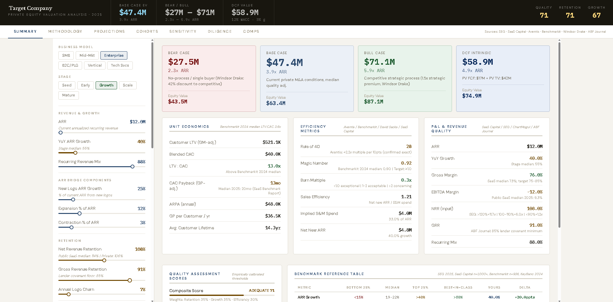

# SaaS & Tech-Enabled Services Valuation Model

An institutional-grade, browser-based valuation tool for evaluating SaaS and tech-enabled services companies. Built to replicate the analytical rigor used in private equity and M&A processes, with all multiples and benchmarks sourced from primary market data.


---

## What It Does

Most SaaS valuation calculators slap a revenue multiple on ARR and call it done. This model does the full job:

- **EV/ARR multiple build-up** with 9 source-cited adjustment factors (growth, Rule of 40, NRR, GRR, gross margin, LTV:CAC, revenue mix, size premium, technology modifiers)
- **Bear / Base / Bull scenarios** anchored to actual M&A transaction data, not public market comps by default
- **Full DCF model** — builds from ARR → Revenue → COGS → GP → OpEx by line → EBITDA → NOPAT → FCF with WACC-discounted PV and terminal value
- **ARR Bridge** — first-principles waterfall: Opening + New Logo + Expansion − Contraction − Churn = Closing, with NRR reconciliation check
- **Cohort retention curves** — 5 vintage cohorts modeled over 7 years, shows whether the installed base self-compounds or erodes
- **Sensitivity heatmaps** — full model re-computed at every cell (not approximations): ARR Growth × NRR, WACC × terminal growth, Gross Margin × EBITDA Margin
- **Comparable company table** — enter up to 3 comps side-by-side with best-in-peer highlighting
- **Diligence scorecard** — weighted 20-item PE-standard checklist (Revenue, Financials, Risk, Legal, Efficiency) with live scoring
- **Automated risk flags** — threshold-based flags with source citations (ABF Journal, SEG, SaaS Capital, Windsor Drake)

---

## Data Sources

Every number in this model is sourced. Key references:

| Parameter | Value | Source |
|-----------|-------|--------|
| Private M&A median multiple | 4.1x ARR | SEG 2025 Annual SaaS Report (3,163 deals) |
| Equity-backed private median | 5.3x ARR | SaaS Capital 2025 survey (n=1,000+) |
| Public SaaS median | 6.7–7.0x ARR | SaaS Capital Index, June 2025 |
| Rule of 40 impact | +2.2x per 10 pts | Aventis Advisors (459 deals, 2015–2025) |
| NRR >120% multiple | 11.7x (public) | SEG 2025 Annual SaaS Report, p.30 |
| NRR 100–110% multiple | 6.0x (public) | SEG 2025 Annual SaaS Report, p.30 |
| Bear scenario discount | ×0.58 (−42%) | Windsor Drake M&A 2025 |
| Bull scenario premium | ×1.50 (+50%) | Windsor Drake M&A 2025 |
| GRR lender covenant floor | 85% | ABF Journal SaaS lending standards 2025 |
| LTV:CAC median | 3.6x | Benchmarkit 2024 (n=936) |
| CAC payback median | 20 months | SaaS Benchmark Report 2025 (n=2,000+) |
| Magic Number median | 0.90 | Benchmarkit 2024 (n=936) |
| Growth endurance | 65%/yr | Benchmarkit 2025 |
| AI-native premium | 20–40% | SaasRise / Battery Ventures 2025 |
| Public/private premium | 36% | SEG: private 4.1x vs public 5.6x, 2024 |

---

## Screenshots


---

## Tech Stack

- **React 18** — UI framework
- **Vite** — build tool
- **Pure SVG** — all charts are hand-rolled SVG (no chart library dependencies)
- **Zero external UI libraries** — everything is custom

---

## Getting Started

### Prerequisites
- Node.js 18+
- npm or yarn

### Local Development

```bash
# Clone the repo
git clone https://github.com/evanjreid/saas-valuation-model.git
cd saas-valuation-model

# Install dependencies
npm install

# Start dev server
npm run dev
```

Open [http://localhost:5173](http://localhost:5173).

### Build for Production

```bash
npm run build
```

Output goes to `dist/`. Deploy this folder to any static host.

---

## Deploying to Vercel (Recommended — Free)

1. Push this repo to GitHub
2. Go to [vercel.com](https://vercel.com) → New Project → Import your repo
3. Framework preset: **Vite** (auto-detected)
4. Click Deploy

Done. Vercel handles everything. Takes about 90 seconds.

---

## Model Architecture

### Multiple Build-Up

The base EV/ARR multiple is constructed as a waterfall of adjustments:

```
Base (stage × business type, private M&A anchored)
  + Growth adjustment      (+0.8x per 10ppts vs stage median)
  + Rule of 40 adjustment  (+2.2x per 10pts — Aventis exact)
  + NRR adjustment         (SEG band data: <90%=1.2x → >120%=11.7x public)
  + GRR adjustment         (ABF covenant floor at 85%)
  + Gross margin adjustment
  + LTV:CAC adjustment
  + Revenue mix adjustment
  × Size premium           (Solganick: ~1-2x per $20M ARR)
  × Technology modifiers   (AI, vertical, network effects, UBP)
= Base Multiple
```

Bear = Base × 0.58 | Bull = Base × 1.50

### DCF Model

```
ARR → Recognized Revenue
Revenue − COGS = Gross Profit
GP − R&D − S&M − G&A = EBITDA
EBITDA − D&A = EBIT
EBIT × (1 − 25% tax) = NOPAT
NOPAT + D&A − Capex − ΔWC + SBC = Free Cash Flow
PV(FCFs) + PV(Terminal Value) = DCF Enterprise Value
```

Terminal value uses Gordon Growth Model. EBITDA multiple cross-check included as a sanity check.

### Cohort Model

Each cohort starts at $1 ARR. Annual retention:
- Logo survival = (1 − logo_churn)^year
- Per-customer expansion = NRR / annual_logo_retention
- Net cohort revenue = logo_survival × per_customer_expansion^year

Curves above 1.0 = self-compounding installed base. Below 1.0 = net revenue decay.

---

## Limitations

This is an analytical tool, not a formal valuation opinion. Real deal valuations depend on:
- Proprietary diligence (cohort data, pipeline audit, QoE analysis)
- Specific buyer synergies and strategic rationale
- Capital market conditions at time of transaction
- Negotiating dynamics and process structure

Use this for initial screening and analytical framing. Engage a qualified M&A advisor for formal opinions.

---

## Contributing

Pull requests welcome. If you find a benchmark that's outdated or a source that's more current, open an issue with the citation.

---

## License

MIT — use freely, attribution appreciated.

---

*Built by [Evan Reid](https://github.com/evanjreid) · [LinkedIn](https://linkedin.com/in/evanjreid)*
